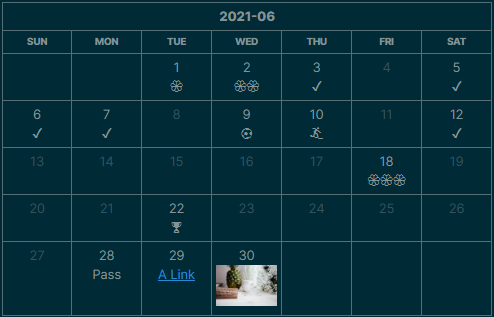

## Obsidian Habit Tracker Plugin

This plguin for [Obsidian](https://obsidian.md/) creates a simple month view for visualizing your punch records.



To show the view above, just create a code block and type:

~~~
```habitt
[month:2021-06]
(1,💮)(2,💮💮)(3)(5)(6)(7)(9, ⚽)(10, 🏄)(12)(18,💮💮💮)(22,🏆)(28,Pass) 
```
~~~

* `[month:YYYY-MM]`: Which month to display
* `(date_num, tag)`: The day (`date_num`) you want to punch in, with a `tag` in it. If `tag` is missing, such as `(12)`, a default tag `✔️` is given to that day.
* `[width: css_width]`: Restrict the Month-view table to `css_width`, such as `[width: 50%]`, `[width: 500px]`

## Installation

You can install the plugin via the Community Plugins tab within Obsidian. Just search for "Habit Tracker"

